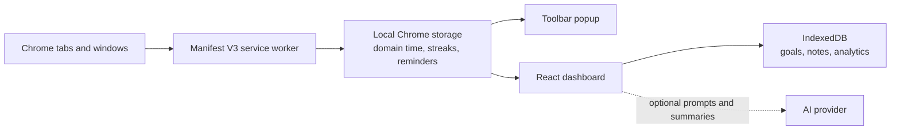

# Daymark

### Make your browser time work for the day you meant to have.

Daymark is a Chrome productivity coach that brings **daily goals, website-time awareness, reflection, and optional AI coaching** into one small extension. See where your time went, turn a messy brain dump into actionable goals, and build momentum one day at a time.

> **Built for focus, not surveillance:** Daymark records the domains you spend time on—not the contents of the pages you visit. Your goals and reflections are stored in your browser.

## What you can do

- **Plan your day:** Create one-and-done goals or numeric targets, mark goals mandatory or optional, and set reminders.
- **Turn a brain dump into a plan:** Paste an unstructured task list; Daymark can use an AI provider to suggest editable goals, with a local heuristic parser as a fallback.
- **Understand your browsing time:** See time spent on the active website, with domains grouped into categories such as coding, education, work, social, and entertainment.
- **Review progress:** Check off goals, track numeric progress, view daily productivity summaries, and follow your goal-completion history and streaks.
- **Reflect:** Save a short daily note about what went well, what got in the way, and what to improve.
- **Get coaching:** Ask the optional AI coach for suggestions based on your day's goal and browsing summaries. Without a configured AI key, the app can use its built-in mock coaching responses.
- **Keep the essentials close:** The toolbar popup shows today's goals, browsing time, a quick score, and the currently active domain.
- **Make it yours:** Set your profile and daily target, switch between light and dark themes, and export supported app records as JSON.

## See the flow



## Get started

### Requirements

- Google Chrome or a Chromium-based browser with Manifest V3 support
- Node.js **20.19+** or **22.12+**
- npm

### Install dependencies and build

```bash
npm install
npm run build
```

The production extension is generated in `dist/`.

### Load Daymark in Chrome

1. Open `chrome://extensions`.
2. Turn on **Developer mode**.
3. Select **Load unpacked**.
4. Choose this project's `dist` folder.
5. Pin Daymark from the Extensions menu, then open its popup or dashboard.

After changing the source, run `npm run build` again and press **Reload** on the Daymark card in `chrome://extensions`.

## Configure AI (optional)

Daymark works without an AI provider. To use live AI features:

1. Open the Daymark dashboard and go to **Settings → AI Configuration**.
2. Choose **Groq**, **OpenAI**, or **Google Gemini**.
3. Paste your API key and save your settings.

Get keys from [Groq](https://console.groq.com/keys), [OpenAI](https://platform.openai.com/api-keys), or [Google AI Studio](https://aistudio.google.com/app/apikey).

The AI key is stored in Chrome's local extension storage. When you use an AI feature, the relevant prompt is sent directly from the extension to the provider you selected. Prompts may include your brain dump or question and a summary of goal completion, browsing time, and visited domains. Review your provider's data policies before sending personal information.

**For contributors:** Do not put a personal API key in a committed file or a public build. `VITE_*` environment variables are compiled into client-side code and are not secret once the extension is built.

## Development

```bash
npm install
npm run dev
```

The Vite dev server starts the UI development build, but Daymark is designed to run as a browser extension. Browser tracking, alarms, and other `chrome.*` APIs require the extension to be loaded in Chrome; use a production build for end-to-end extension testing.

Available scripts:

| Command | Purpose |
| --- | --- |
| `npm run dev` | Start the Vite development server |
| `npm run build` | Type-check and create the extension bundle in `dist/` |
| `npm run lint` | Run Oxlint |
| `npm run preview` | Preview the built web bundle |

## How it is built

| Layer | Technology | Responsibility |
| --- | --- | --- |
| Extension | Chrome Manifest V3 | Toolbar popup, dashboard page, and background service worker |
| UI | React, TypeScript, Vite | Dashboard, goal management, reflection, analytics, and settings |
| Browser-time tracking | Chrome tabs/windows APIs | Measure active-tab time by domain and maintain daily totals |
| Local persistence | IndexedDB (`idb`) and `chrome.storage.local` | Keep app records and extension state in the browser |
| Charts and icons | Recharts and Lucide | Analytics visualizations and interface icons |
| Optional coaching | Groq, OpenAI, or Gemini APIs | Generate coaching responses and structured goal suggestions |

### Project layout

```text
.
├── manifest.json                 # Extension metadata and permissions
├── popup.html                    # Toolbar popup entry point
├── dashboard.html                # Full dashboard entry point
├── src/
│   ├── App.tsx                   # Dashboard pages and app flows
│   ├── popup/popup.tsx            # Compact toolbar experience
│   ├── background/service-worker.ts
│   ├── content/content.ts         # Intentionally no-op content script
│   ├── services/
│   │   ├── ai.ts                 # AI providers and local parser/fallbacks
│   │   ├── analytics.ts          # Domain categories and analytics helpers
│   │   └── storage.ts            # IndexedDB and Chrome storage operations
│   └── types/index.ts            # Shared TypeScript types
└── vite.config.ts                # Multi-entry extension build
```

## Privacy and permissions

Daymark has no application server or account system of its own. Goals, notes, and other app records are stored locally in browser storage. The service worker observes the active tab's **domain** and elapsed time; the content script currently does not inspect or scrape page content.

Some functionality uses external services:

- **AI providers:** receive the prompt and the relevant summaries when you choose a live AI feature.
- **Google favicon service:** the analytics page requests website icons using the domain name.
- **Google identity:** the dashboard may read the signed-in Chrome profile email to prefill your profile.

The extension currently declares these permissions in `manifest.json`:

| Permission | Why it is declared |
| --- | --- |
| `tabs` | Observe the active tab and its URL domain for time tracking |
| `history` | Declared for the dashboard's today's-history visit-count lookup |
| `storage` | Store extension preferences, profile, and tracking state locally |
| `alarms`, `notifications` | Schedule goal reminders and streak notifications |
| `identity`, `identity.email` | Read the signed-in profile email for profile convenience |
| `activeTab`, `scripting`, `<all_urls>` | Declared extension/page access; the current content script is a no-op |

### Current implementation notes

- The tracking controls in Settings are saved as preferences, but the background tracker does **not yet use those controls to pause tracking**. Reloading or switching off those settings should not be treated as a tracking opt-out in this version.
- **Export Data** downloads the IndexedDB records (such as goals, reflections, analytics, and insights). It does not currently include all values stored separately in `chrome.storage.local`, such as the profile/API key and live daily tracking totals.
- **Clear All Data** clears the app's IndexedDB and web `localStorage`; it does not currently clear `chrome.storage.local`.
- Website categories are based on known domains and simple name heuristics; they are estimates, not a judgment about how you used a site.

These behaviors are documented so you can make an informed choice while using the current build.

## Contributing

Contributions are welcome. For a focused change:

1. Create a branch from `main`.
2. Install dependencies with `npm install`.
3. Make and verify your change with `npm run build` and `npm run lint`.
4. Open a pull request describing the user-visible behavior and any permissions or data-flow changes.

When changing tracking or AI behavior, please keep data minimization and clear user consent in mind.
